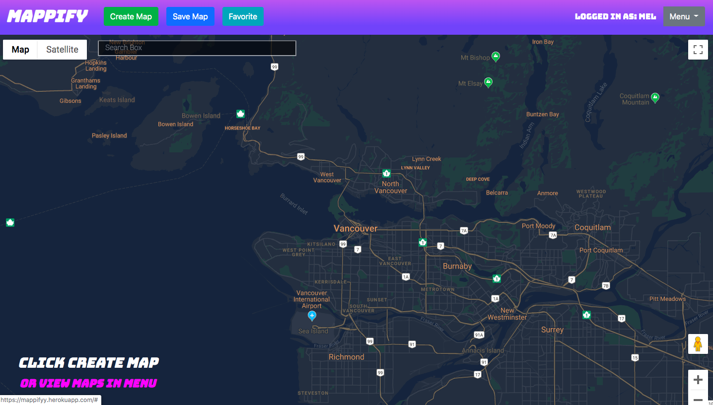
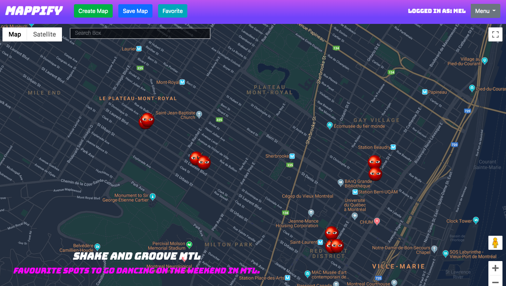
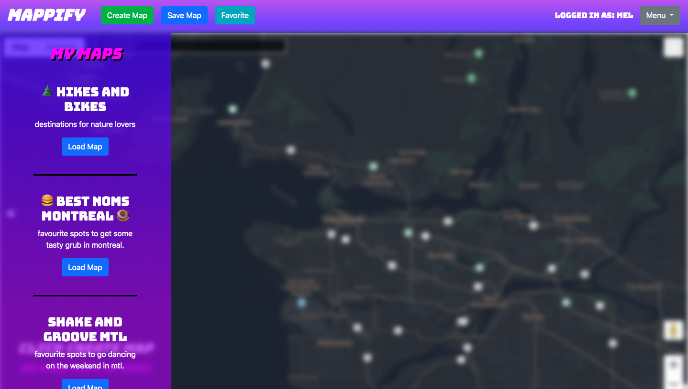

# Mapplication Project

## Table Of Contents

  - [Description](#description)
  - [Stack](#stack)
  - [Final Product](#final-product)
  - [Getting Started](#getting-started)
  - [Dependencies](#dependencies)
  - [Contributions](#contributions)

## Description
Mapplication is a single-page map based web application. It allows users to create thier own custom maps, or create maps collaboritivly by contributing to maps other users have made. Users have the ability to browse and view public maps made by other users as well as store them as 'favourites'.

## Stack
### Back-End
- Node.js
- Express
- Cookie Sessions
- Postgres SQL

### Front-End
- Google Maps JS API
- Google Maps Places API
- Javascript
- jQuery
- AJAX
- EJS
- CSS

## Final Product
 
  
  

## Getting Started
Simply click [here](https://mappifyy.herokuapp.com/login/4)

or to run project locally ...

1. Clone this repository.
2. Install dependencies using the `npm install` command.

3. Connect to `psql` in the terminal and create tables by running command `\i db/schema/midterm.sql`  and create test users by running `\i db/seeds/01_users.sql`
      - Not sure how to set up a database ?  See, [postgres docs](https://www.postgresql.org/docs/)
   
4. Start the web server using the `npm run local` command. The app will be served at <http://localhost:8080/>.

5. Go to <http://localhost:8080/> in your browser.

## Dependencies
    body-parser: ^1.19.0
    chalk: ^2.4.2
    cookie-session: ^1.3.3
    dotenv: ^2.0.0
    ejs: ^2.6.2
    express: ^4.17.1
    morgan: ^1.9.1
    node-sass-middleware: ^0.11.0
    pg: ^6.4.2
    pg-native: ^3.0.0

## Contributions
  This app was created by...

- https://github.com/umrude
- https://github.com/curriecode
- https://github.com/JacksonStark
